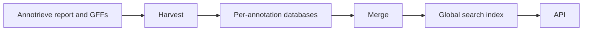

# annotrieve-xrefs

Search genes across [Annotrieve](https://genome.crg.es/annotrieve) annotations by accession — gene symbol, Gene Ontology term, UniProt id, and other cross-references.

**Base URL:** `https://genome.crg.es/annotrieve-xrefs/api/v1`

This service is a sidecar to Annotrieve. Annotrieve still owns the main annotation catalogue; this API owns gene-level search and per-annotation gene/xref cards.

Typical flow:

1. **Catalogue** — browse namespaces and accessions (`/namespaces…`)
2. **Search** — find matching loci or annotations (`/hits`, `/hits/annotations`)
3. **Drill in** — open one annotation’s genes and their xrefs (`/annotations/{id}/genes…`)

---

## Pagination

List endpoints return opaque `next` and `previous` page tokens. Pass one back as the matching query parameter (or POST body field). Do not send both at once.

- Default `limit` is **100**; maximum is **200**.
- Tokens are bound to the request filters (`curies`, `taxid`, `accessions`, `q`, sort). Changing filters while reusing a token returns **400** with `cursor_filter_mismatch` — start again from the first page.

Failed responses use a common envelope: `{"detail": {"code": "...", "message": "..."}}` (optional extras such as `max` / `errors`). Framework validation failures are **422** with `code=validation_error`.

Production also applies modest rate limits (**3 req/s per IP**, ~**20 req/s** globally). Saturated `/hits` concurrency returns **503** with `Retry-After: 1`.

---

## CURIEs

Search ids use Compact URIs: `prefix:accession` (first colon splits prefix from accession).

| Prefix in the request | Stored namespace |
|---|---|
| `swiss-prot` | `uniprot/swiss-prot` |
| `trembl` | `uniprot/trembl` |
| `imgt` | `imgt/gene-db` |
| any Tier A name (e.g. `symbol`, `go`, `hgnc`) | same name |

Normalization:

- **GO** — short forms pad to seven digits (`GO:8150` → `GO:0008150`).
- **symbol / alias** — accessions are casefolded (`TP53` → `tp53`).

Unknown prefixes are reported in the `errors` array on `/hits` (results for valid CURIEs still return). On `/annotations/…/genes?q=…`, a bad CURIE is a **400**.

---

## API reference

Paths below are relative to the base URL.

### `GET /namespaces`

List namespaces present in the published corpus.

```json
{
  "total": 4,
  "results": [
    {"namespace": "alias", "accession_count": 1},
    {"namespace": "go", "accession_count": 1},
    {"namespace": "symbol", "accession_count": 1}
  ],
  "next": null,
  "previous": null
}
```

### `GET /namespaces/{namespace}`

One namespace summary.

```json
{"namespace": "symbol", "accession_count": 1}
```

Slash namespaces work in the path (e.g. `/namespaces/uniprot/swiss-prot`).

### `GET /namespaces/{namespace}/accessions`

Paginated accessions in a namespace.

| Parameter | Notes |
|---|---|
| `sort` | `n_genes` (default), `n_annotations`, or `accession` |
| `sort_order` | `desc` (default) or `asc` |
| `accessions` | Optional CSV filter (normalized; max 20 values) |
| `limit`, `next`, `previous` | Pagination |

```json
{
  "total": 1,
  "results": [
    {
      "namespace": "symbol",
      "accession": "tp53",
      "n_annotations": 2,
      "n_genes": 2
    }
  ],
  "next": null,
  "previous": null
}
```

### `GET /namespaces/{namespace}/accessions/{accession}`

One accession card (`n_annotations`, `n_genes`). GO and symbol/alias forms are normalized the same way as CURIEs.

```json
{
  "namespace": "go",
  "accession": "GO:0008150",
  "n_annotations": 2,
  "n_genes": 2
}
```

### `GET` / `POST /hits`

Cross-annotation **locus** hits: one row per matching gene in an annotation.

| | GET | POST |
|---|---|---|
| CURIEs | `curies` CSV query param | JSON `{"curies": [...]}` |
| Max CURIEs | **20** | **100** |
| Optional | `taxid`, `limit`, `next`, `previous` | same fields in the body |

`taxid` keeps annotations whose taxonomy lineage includes that NCBI id (species or ancestor).

```http
GET /hits?curies=symbol:tp53,alias:tp53&taxid=40674
```

```json
{
  "taxid": 40674,
  "results": [
    {
      "annotation_id": "ann-human",
      "local_id": 10,
      "seqid": "NC_000017.11",
      "start": 7661779,
      "end": 7687550,
      "strand": "-",
      "primary_name": "TP53",
      "matched": ["symbol:tp53", "alias:tp53"]
    }
  ],
  "next": null,
  "previous": null,
  "errors": []
}
```

### `GET` / `POST /hits/annotations`

Same CURIE inputs as `/hits`, but **one row per annotation**: how many distinct genes matched, and which CURIEs hit.

Use this when you need a list of annotations first; use `/hits` when you need individual loci.

```http
GET /hits/annotations?curies=symbol:tp53
```

```json
{
  "results": [
    {
      "annotation_id": "ann-human",
      "n_genes": 1,
      "matched": ["symbol:tp53"]
    },
    {
      "annotation_id": "ann-mouse",
      "n_genes": 1,
      "matched": ["symbol:tp53"]
    }
  ],
  "next": null,
  "previous": null
}
```

### `GET /annotations/{annotation_id}/genes`

Browse genes inside one annotation’s gene corpus (not Annotrieve’s annotation catalogue).

| Parameter | Notes |
|---|---|
| `q` | If it contains `:`, treat as one CURIE (xref filter). Otherwise casefold **prefix** match on `primary_name` (max 64 chars). |
| `limit`, `next`, `previous` | Pagination |

```http
GET /annotations/ann-human/genes?q=symbol:tp53
```

```json
{
  "annotation_id": "ann-human",
  "results": [
    {
      "annotation_id": "ann-human",
      "local_id": 10,
      "seqid": "NC_000017.11",
      "start": 7661779,
      "end": 7687550,
      "strand": "-",
      "primary_name": "TP53",
      "prose": "tumor protein p53"
    }
  ],
  "next": null,
  "previous": null
}
```

### `GET /annotations/{annotation_id}/genes/{local_id}`

One gene card (coordinates, name, prose). No embedded xrefs — use the xrefs route below.

```json
{
  "annotation_id": "ann-human",
  "local_id": 10,
  "strand": "-",
  "primary_name": "TP53",
  "prose": "tumor protein p53"
}
```

### `GET /annotations/{annotation_id}/genes/{local_id}/xrefs`

Paginated cross-reference chips for one gene (Tier A and Tier B namespaces stored on the shard).

```json
{
  "annotation_id": "ann-human",
  "local_id": 10,
  "results": [
    {"namespace": "alias", "accession": "tp53"},
    {"namespace": "go", "accession": "GO:0008150"},
    {"namespace": "symbol", "accession": "tp53"}
  ],
  "next": null,
  "previous": null
}
```

---

## Indexed namespaces

### Tier A — global search

These namespaces appear in the catalogue (`/namespaces`) and power `/hits` / `/hits/annotations`.

**Identity**

`symbol`, `alias`, `geneid`

**Domains / families / ontology**

`interpro`, `pfam`, `go`, `goa`, `rfam`, `cdd`, `tigrfam`, `ncbiortholog`, `jgidb`, `phytozome`, `mirbase`

**Model / community databases**

`hgnc`, `mgi`, `rgd`, `zfin`, `vgnc`, `flybase`, `wormbase`, `sgd`, `tair`, `xenbase`, `dictybase`, `vectorbase`, `pombase`, `rap-db`, `araport`, `beebase`, `beetlebase`, `bgd`, `aphidbase`, `cgd`, `genedb`, `mim`, `marpolbase`, `apidb_toxodb`, `apidb_cryptodb`, `apidb_plasmodb`, `imgt/gene-db`, `ensembl`, `ensemblgenomes`, `cgnc`, `fungidb`, `i5knal`, `nasoniabase`

**UniProt**

`uniprot/swiss-prot` (CURIE prefix `swiss-prot`), `uniprot/trembl` (prefix `trembl`), `uniprotkb`

**eggNOG / COG**

`eggnog`, `cog`

### Tier B — per-annotation only

Kept on each annotation’s gene shard (visible via gene xref chips and local browse) but **not** in the global hit index.

`locus_tag`, `ncbi_gp`, `refseq_protein`, `protein_id`, `ensembl_protein`, `genbank`, `ensembl_transcript`, `ensemblgenomes-tr`, `refseq_transcript`, `submitter_transcript`, `submitter_protein`, `ccds`, `vista`, `pseudo`, `dbsnp`, `pdb`, `pir`, `hssp`, `hmp`, `insdc_protein`, `refseq_mrna`, `pathema`

---

## Building the corpus

The searchable index is built in two steps:

1. **Harvest** — walk published annotations and their GFF files; extract genes and cross-references into one small database per annotation.
2. **Merge** — combine those per-annotation databases into the global search index the API serves (namespace catalogue, hit lookup, taxonomy).

Harvest can run incrementally as new annotations appear. Merge rebuilds the searchable corpus from whatever per-annotation databases exist.



---

## Appendix: local development

```bash
# Optional: point at a published corpus directory
export GENE_CORPUS_HOST_DIR=/path/to/gene_corpus

docker compose -f docker-compose-dev.yml up --build
```

- API: http://localhost:5003
- Via nginx: http://localhost:95/annotrieve-xrefs/api/v1

### Tests

```bash
pip install -r requirements-dev.txt
PYTHONPATH=api:. pytest gene_corpus/tests api/tests -q
```
